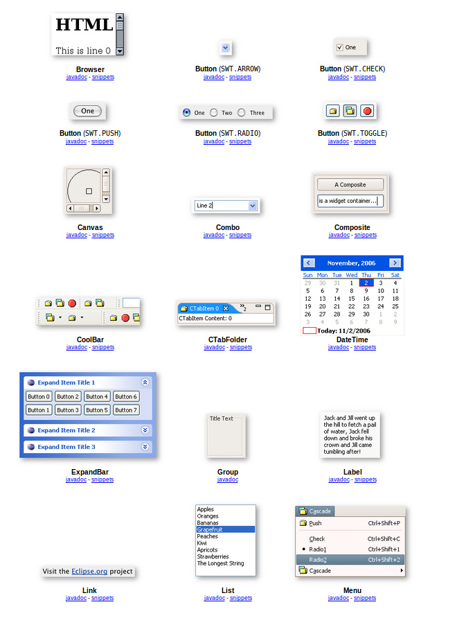

# STANDARD WIDGET TOOLKIT

---

### 1. QUÉ ES SWT?

SWT, del inglés _Standard Widget Toolkit_ es un conjunto de componentes para construir interfaces gráficas en Java. El proyecto es 100% de código abierto y su desarrollo principal corre al cargo del proyecto Eclipse. Es básicamente una forma más que tenemos en Java de diseñar interfaces de usuario interactivas, que presenta ciertas ventajas con respecto a sus alternativas, pero también una serie de desventajas bien claras. En esta presentación vamos a llevar a cabo una introducción lo más completa posible acerca de cómo usar esta herramienta, sus ventajas y desventajas, principales usos, y otras peculiaridades.

---

### 2. RAZONES DE SU EXISTENCIA

SWT recupera la idea original de la biblioteca AWT de utilizar componentes nativos, con lo que adopta un estilo más consistente entre todas las plataformas, pero a la vez trata de no caer en las limitaciones de estas. La biblioteca SWING está codificada enteramente en Java y funciona bastante bien, pero algunos desarrolladores la acusan de no ofrecer una experiencia idéntica a la de una aplicación nativa.

Entonces surge SWT con el objetivo de mantenerse a un nivel más cercano al sistema operativo, y por ende a la librería AWT. El precio a pagar por esto es la dependencia a nivel visual del sistema operativo sobre el que se ejecuta la aplicación.

SWT recupera la idea original de AWT de utilizar componentes nativos, al menos siempre que sea posible. La diferencia es que SWT provee al desarrollador de una mayor cantidad de estos, comúnmente llamados widgets. Esto es debido a que si un widget no está disponible nativamente para una plataforma, SWT lo emula internamente.

Los usos que se le dan a SWT son dos:

* Desarrollo de aplicaciones interactivas, sustituyendo a SWING o AWT como framework para la interfaz.
* Desarrollo de plug-ins para Eclipse. Las aplicaciones de Eclipse normalmente utilizan SWT para la interfaz de usuario. Para desarrollar plug-ins que extiendan las funcionalidades del IDE, se tiene que usar SWT.

---

### 3. SWT vs SWING

Las ventajas de SWING con respecto a SWT son:

* Forma parte de las librerías de Java, así que no son necesarias librerías externas.
* Funciona exactamente igual en todas las plataformas.
* Existen editores gráficos para SWING en casi cualquier IDE.
* Está soportado por extensiones oficiales de Java como java OpenGL.
* La documentación está proporcionada por Oracle y es muy extensa y detallada.

Por contra:

* No proporciona una experiencia idéntica a la de una aplicación nativa del sistema operativo con el que se trabaja, como ya hemos mencionado.
* El uso de componentes pesados se superpone al uso de los componentes ligeros de SWING, lo cual no suele ser un problema ya que ambos se entendieron para trabajar en solitario, no combinados.

Las ventajas de SWT con respecto a SWING son:

* Utiliza componentes nativos cuando es posible, lo cual implica también un comportamiento nativo al SO.
* Fuertemente soportado por el IDE Eclipse.

Por contra:

* Requiere de librerías nativas en el sistema en el que se va a ejecutar la aplicación.
* Podría no emular cualquier tipo de comportamiento debido al uso de componentes nativos. Si un comportamiento no se puede emular en un sistema directamente, entonces SWT tampoco puede.

---

### 4. LAS LIBRERÍAS DE ECLIPSE

A día de hoy todos sabemos perfectamente lo que es un paquete en Java. Más allá de poder crear nuestros propios paquetes, más del 50% del código que utilizamos en cada programa no es realmente nuestro, sino que las estructuras más básicas se encuentran en algún paquete disponible públicamente. Por ejemplo, el paquete `java.util` para las colecciones, o `java.io` para el manejo de ficheros en la entrada-salida.

Eclipse también pone a disposición de los desarrolladores sus propias librerías por medio del paquete `org.eclipse`. Dentro del mismo encontramos `org.eclipse.swt`. Estas librerías no se encuentran en el propio compilador de Java, como las anteriormente mencionadas, sino que se tienen que instalar manualmente.

---

### 5. CÓMO INSTALARLO

Si queremos hacer uso de SWT en nuestro proyecto, tenemos que importar manualmente las dependencias, ya que el código no se encuentra en las dependencias del propio lenguaje.

1. Lo primero es ir a la página de descarga de SWT.
2. Seleccionamos la última versión estable y luego, en la siguiente página, hacemos scroll hasta abajo. Deberían aparecer las versiones para los diferentes sistemas operativos. Descargamos el `.zip` correspondiente al sistema en el que vayamos a desarrollar.
3. Los siguientes pasos son bastante similares a como se suelen importar dependencias. Descomprimimos el fichero `.zip` descargado. Veremos un archivo `swt.jar`; ese es el que nos interesa.
4. Vamos a las propiedades de nuestro proyecto pulsando click derecho sobre el mismo y vamos a la sección `Java Build Path`. En la pestaña `Libraries > Add JARs` si hemos copiado el archivo anteriormente mencionado dentro de nuestro proyecto, o `Libraries > Add External JARs` si lo hemos dejado fuera del mismo.
5. Pulsamos `Apply` y todo debería estar listo.

---

**EJECUTAR AQUÍ EL PRIMER EJEMPLO DE HOLA MUNDO**

---

### 6. LOS WIDGETS



Los widgets de SWT se encuentran en los paquetes `org.eclipse.swt.widgets` y `org.eclipse.swt.custom`, y todas ellas son clases hijas o de la clase `Widget` o de la clase `Control`. Tenemos que destacar principalmente dos tipos de widgets: `Display` y `Shell`. El primero representa la conexión entre SWT y el sistema operativo: implementa el bucle de detección de eventos y provee información al resto de widgets acerca del sistema operativo.

`Shell`, por su parte, representa una ventana. Posee varios métodos muy similares a los de la clase JFrame de SWING, como puede ser `setText()`, `setSize()` o `pack()`. Para hacerla visible en pantalla, se utiliza el método `open()`.

Hay una serie de líneas de código muy importantes que se tienen que escribir en todo programa que use SWT. Este código activa el bucle principal de eventos con el sistema operativo y lo mantiene mientras la ventana no se haya cerrado. Una vez se cierra, se liberan los recursos proporcionados por el sistema operativo.

```java
while (!shell.isDisposed()) {
  if (!display.readAndDispatch()) {
    display.sleep();
  }
}
display.dispose();
```

---

**MOSTRAR EJEMPLO DEL BOTÓN QUIT**

---

### 7. CREANDO APLICACIONES INTERACTIVAS CON SWT

**EJEMPLO CON TODOS LOS ELEMENTOS EN UNA VENTANA, PARA IR ENSEÑÁNDOLOS**

El resto de widgets son similares a los contenedores y elementos principales que hemos visto en SWING, pero se construyen indicando cuál es el widget "padre" que los contiene. SWING, en cambio, define directamente sus elementos y luego introduce unos dentro de otros. El único widget que no tiene que especificar a su padre al ser definido es `Display`, pues su padre siempre es el sistema operativo.

Entonces, cada vez que se define un determinado widget, su primer parámetro debe ser el widget que lo va a contener. El segundo parámetro hace referencia a los llamados `stylebits`. Estos, dependiendo del valor que tomen, le otorgan al widget una apariencia y comportamiento diferente. Los valores vienen predefinidos como constantes públicas de la clase SWT.

Por ejemplo, los siguientes constructores generan un botón push y un botón checkbox. Ambos se introducen dentro de la componente `shell`. La variación, como se puede ver, está en el valor del _stylebit_:

```java
Button pushButton = new Button(shell, SWT.PUSH);
Button checkBox = new Button(shell, SWT.CHECK);
```

**VOLVEMOS AL EJEMPLO ANTERIOR PARA EXPLICAR UN POCO MEJOR LOS STYLEBITS**

---

### 8. POSICIONAMIENTO DE LOS WIDGETS

Por supuesto, tenemos muchos widgets a nuestra disposición, pero no nos sirven de nada si no somos capaces de distribuirlos alrededor de la interfaz de la forma en la que nosotros queremos. En SWING, los contenedores como `JPanel` o `JFrame` tenían los _layouts_, y también los tenemos en SWT, aunque son ligeramente diferentes.

Evidentemente, establecerle un _layout_ a un botón no es precisamente útil, ya que en su interior no vamos a situar nada. Estos se establecen para los contenedores. `Composite` es un contenedor de SWT para situar en su interior widgets hijos en una estructura determinada. Esta estructura se define con el método `setLayout()`.

`Shell`, la ventana, es un ejemplo de `Composite`, que no tiene un _layout_ definido por defecto, sino que si no se especifica, realiza posicionamiento absoluto. Este viene a ser un posicionamiento manual, a pelo, indicando directamente la posición del widget dentro de la interfaz mediante píxeles. Esto hace que, al redimensionar la ventana, los widgets no cambien de posición, y nos deja sin garantías ningunas de que la aplicación luzca igual de bien en diferentes plataformas. Además, una simple modificación como el cambiar la fuente ya puede dejar la interfaz patas arriba. Por ello, es un tipo de posicionamiento que no suele utilizarse, salvo que estés desarrollando un ejemplo puntual o algo así. Se utilizan los métodos `setSize()`, `setLocation()` y `setBounds()`.

---

**EJEMPLO DE POSICIONAMIENTO ABSOLUTO**

---

* **FillLayout**

Este tipo de estructura es la más simple y divide el espacio disponible de forma igualitaria para todos los widgets. Puede repartirles el espacio de forma horizontal, usando el _stylebit_ `SWT.HORIZONTAL`, o verticalmente (`SWT.VERTICAL`). También permite especificar la separación entre los widgets mediante su atributo `spacing` y el margen de los mismos con respecto al contenedor con los atributos `marginWidth` y `marginHeight`.

---

**EJEMPLO DE FILLLAYOUT**

---

Antes de seguir con las otras tres distribuciones que vamos a ver, tenemos que revisar el concepto de _layout data_. En SWT, cada widget que incluyamos en nuestra interfaz puede tener una serie de ajustes específicos para su posicionamiento, por medio de objetos que podemos asociarles. Estos objetos son los _layout data_ y tenemos varios. Por ejemplo, para el GridLayout, que ahora lo veremos, tenemos los objetos GridData. Podemos definir el posicionamiento del widget, su orientación dentro de la sección que ocupa, los márgenes que tiene con respecto a otros elementos...

* **RowLayout**

Esta distribución es muy similar a `FillLayout`, en el sentido de que distribuye los componentes en una fila (`SWT.HORIZONTAL`) o en una columna (`SWT.VERTICAL`). La diferencia está en que no reparte necesariamente el espacio de forma equitativa entre sus elementos, sino que nos da la posibilidad de manejar diversos parámetros para que cada widget tenga las dimensiones, margen y separación que deseemos. Estos parámetros se manejan utilizando objetos RowData que se asocian a los widgets.

---

**EJEMPLO DE ROWLAYOUT**

---


* **GridLayout**

El GridLayout ya lo conocemos de SWING, aunque este no es exactamente el mismo. Este es propio del paquete de `swt`, pero la idea es exactamente la misma: distribuir los elementos en una matriz con un número de filas y columnas dado. Además, disponemos de algunos parámetros extra para hacer que un determinado widget ocupe más de una celda, y el múltiples direcciones.

---

**EXPLICAR USANDO EL EJEMPLO DE LA CALCULADORA**

---

* **FormLayout**

Por último, tenemos `FormLayout`, una distribución bastante útil que permite relacionar anclar a cada widget en posiciones determinadas del espacio de su contenedor. Para hacer esto, se crean lo que se llaman objetos `FormAttachment` y se asocian a los parámetros de los FormData.

---

**EXPLICAR USANDO EL EJEMPLO DE FORMLAYOUT**

---

### 9. LOS DIALOGS

Los _dialogs_ son elementos indispensables en las interfaces de usuario modernas. Un diálogo por sí solo se define como una conversación, y en una aplicación no deja de ser algo muy parecido. Se trata de una ventana que "dialoga" con la aplicación para importar o exportar datos, sobre todo. Son, por tanto, uno de los elementos más importantes para la comunicación entre el usuario, el programa y los datos externos al programa.

* **LOS MESSAGEBOX**
* **DIRECTORY DIALOG**
* **COLOR DIALOG**
* **FILE DIALOG**

---

**MOSTRAMOS EL EJEMPLO DEL CLUB DE FANS DE ZIDANE**

---

### 10. PROGRAMACIÓN ORIENTADA A EVENTOS CON SWT


---

### 11. EJEMPLO FINAL

---
